# Relatório de Desenvolvimento: Projeto Django com Docker
**Identificação:** Julio Gleison da Silva -- 20242014040033
 
**Professor:** Leonardo Ateide Minora

## Introdução
Esta atividade foi desenvolvida como parte integrante da disciplina de **Sistemas Operacionais**, no curso de TADS, vinculado à **DIATINF** do **Campus IFRN NATAL CENTRAL**. 

### 1. Início do Projeto e Criação da App

Comecei configurando o `Dockerfile.dev` e subindo o container. Utilizei o terminal para criar o projeto principal e a aplicação chamada `nucleo`. Os comandos de inicialização foram executados direitinho

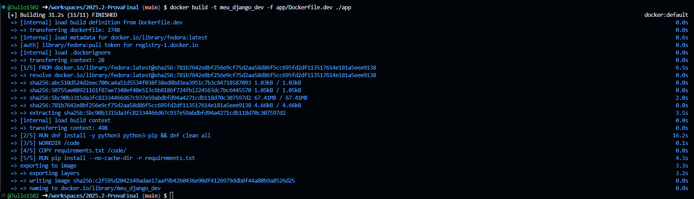
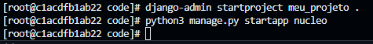

 

### 2. Ajuste de Permissões e Configurações de Sistema

Um dos maiores desafios foi o conflito de permissões de escrita entre o usuário do container e o meu usuário no Codespaces. 
Pra tentar resolver utilizei o comando, procurado na IA, `chown -R 1000:1000 /code`, que permitiu editar o arquivo `settings.py` para registrar tudo e configurar.

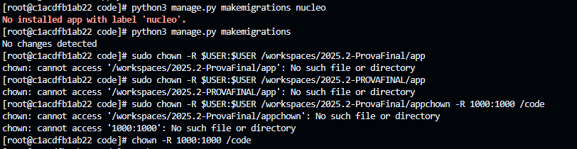
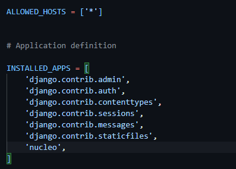

 

### 3. Migração do Banco de Dados

Com "tudo" pronto, executei as migrações para preparar o banco de dados.

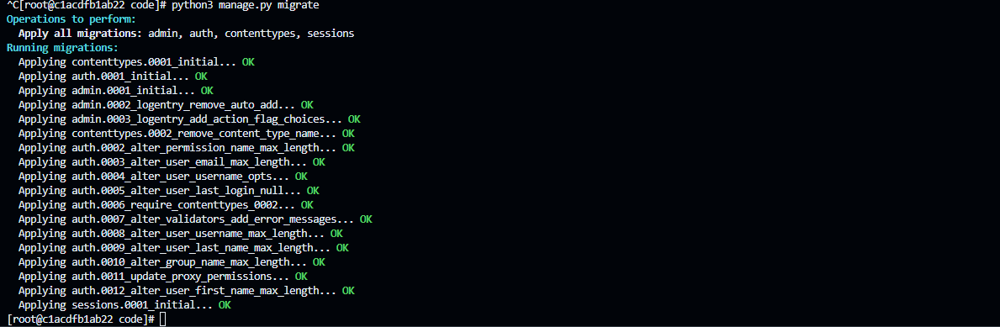

 

### 4. Criando o SUPERUSER
Logo após as migrações, criei um superusuario com o username: admin e o password:123

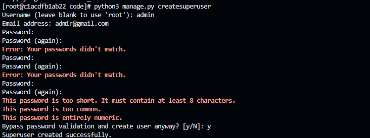

 

### 5. Página Inicial (view)

Criei uma view em `views.py` para exibir a mensagem solicitada.

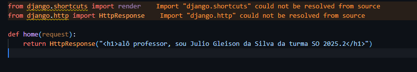

 

### 6. Criação e modificações nos arquivos de urls
Aqui eu criei um arquivo em `nucleo` e adicionei as configurações necessárias, juntamente com as modificações do mesmo arquivo so que em `meu_projeto`

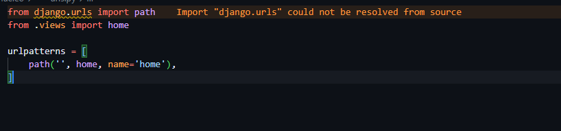
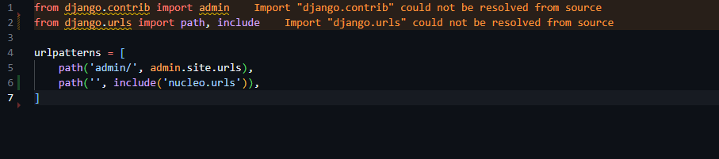

 

### 7. "Primeira" execução do servidor
Já estava tentando rodar antes, mas vi que faltava muitas configurações e fui terminar umas parte do passo a passo da atividade para ver se funcionava

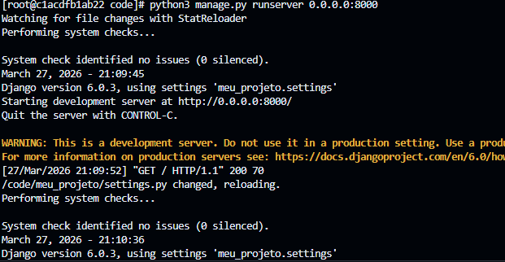

### 8. Mensagens
Só mostrando que uma parte deu certo, que foi a home. Já no admin, tentei diversas coisas para acessar o admin e mesmo assim não consegui, acabei desistindo :/ utilizei tudo que é IA e mesmo assim ficou nesse erro. Tentei diversas coisas e não faço ideia do que deu errado, ou estava fazendo de errado.

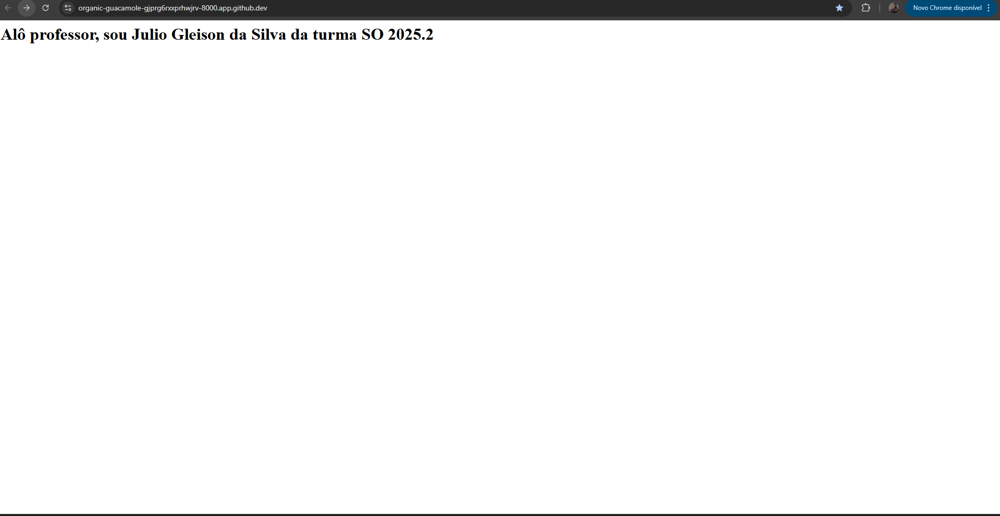

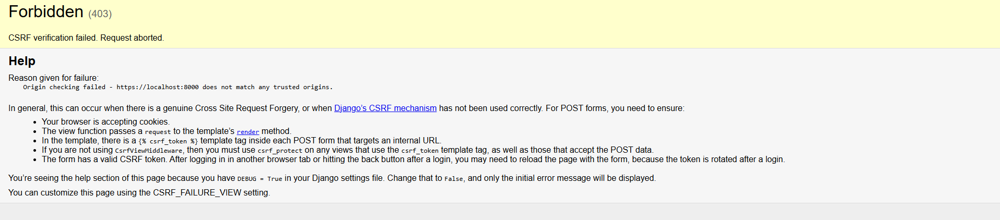

Acredito que o senhor vá ver diversas mudanças na pasta setting.py sobre o CSRF, vou commitar com elas para fins do relatório, claro que aquilo so foi uma das diversas coisas que tentei.
---

## Considerações Finais

A atividade permitiu entender na prática como o Linux (Fedora) opera dentro de um container e como gerenciar permissões de arquivos — um conceito vital de Sistemas Operacionais. 

A maior dificuldade foi a configuração do protocolo CSRF, com toda a certeza, e as permissões de escrita. 